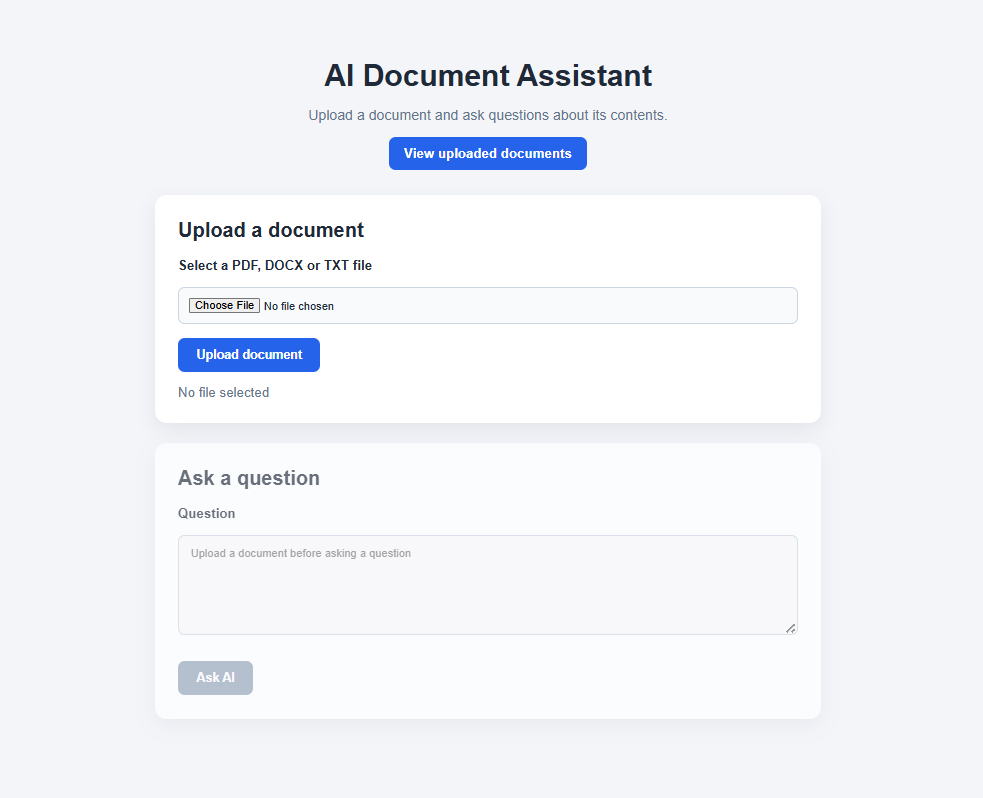
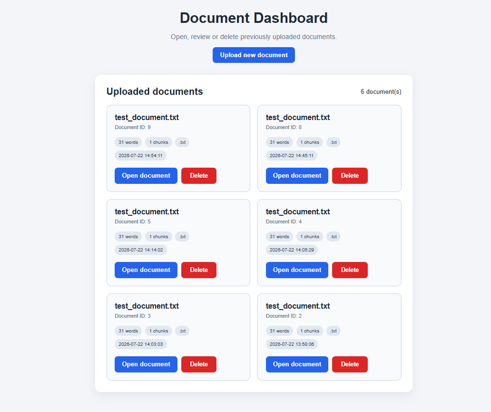

# AI Document Assistant

A full-stack Retrieval-Augmented Generation (RAG) application that allows users to upload documents, search their contents semantically, and receive grounded AI-generated answers with source citations.

The project is built with Flask, OpenAI, Sentence Transformers, ChromaDB, SQLite, HTML, CSS, JavaScript, and Pytest.

---

## Project Overview

The AI Document Assistant allows users to:

- Upload PDF, DOCX, and TXT documents
- Extract and clean document text
- Split content into overlapping chunks
- Generate local vector embeddings
- Store and search embeddings using ChromaDB
- Ask questions about uploaded documents
- Receive streamed AI answers grounded in retrieved content
- View source chunks and similarity scores
- Save and reopen conversation history
- Track response time and token usage
- Manage uploaded documents from a dashboard
- Delete documents and all related data
- Debug requests using structured logs and request IDs

---

## Screenshots

### Home Page

The home page allows users to upload a supported document and access the uploaded-document dashboard.



### Uploaded Document

After a successful upload, the application displays document metadata, extracted text, chunk information, embedding dimensions, and vector count.


### AI Answer and Retrieved Sources

The assistant streams a grounded answer and shows response time, token usage, the selected model, source chunks, and similarity scores.


### Conversation History

Questions, answers, model details, token usage, response time, and retrieved sources are saved and displayed in the conversation history.


### Document Dashboard

The dashboard lists previously uploaded documents and allows users to reopen or delete them.



---

## Main Features

### Document Processing

- Supports `.pdf`, `.docx`, and `.txt`
- Maximum upload size of 10 MB
- Secure filename handling
- Text extraction using format-specific libraries
- Text cleaning and overlapping chunk generation
- Document metadata and chunks stored in SQLite

### Semantic Search

- Uses the `all-MiniLM-L6-v2` sentence-transformer model
- Generates 384-dimensional embeddings
- Stores embeddings and metadata in ChromaDB
- Converts questions into embeddings
- Retrieves the most relevant document chunks
- Displays similarity percentages for retrieved sources

### Grounded AI Answers

- Uses the OpenAI Responses API
- Streams answer text to the browser
- Restricts answers to retrieved document context
- Includes source labels such as `[Source 1]`
- Rejects unsupported claims when the document does not contain the answer
- Treats instructions inside uploaded documents as untrusted content

### Conversation History

- Stores questions and answers in SQLite
- Saves source text and similarity scores
- Saves response time
- Saves input, output, and total token usage
- Saves model name and timestamp
- Reloads history when reopening a document

### Document Dashboard

- Lists uploaded documents
- Displays filename, ID, type, word count, chunk count, and upload time
- Reopens previously processed documents
- Continues existing conversations
- Deletes documents from:
  - SQLite
  - ChromaDB
  - Local uploads folder

### Logging and Error Handling

- Structured JSON logging
- Unique request ID for every request
- Request method, route, status, and duration tracking
- Rotating log files
- Request IDs included in API errors and response headers
- Consistent JSON error format

### Automated Testing

The project includes 33 passing Pytest tests covering:

- Text cleaning
- Chunk creation
- Chunk validation
- TXT extraction
- DOCX extraction
- Unsupported file handling
- Empty document handling
- SQLite document persistence
- Chunk persistence
- Chat-history persistence
- Cascade deletion
- Upload validation
- Semantic-search endpoints
- Health endpoint
- Request IDs
- Dashboard rendering
- Reopening documents
- Successful deletion
- File deletion
- Vector deletion
- Deletion error handling

---

## Technology Stack

### Backend

- Python
- Flask
- SQLite
- OpenAI Python SDK

### AI and Retrieval

- Sentence Transformers
- `all-MiniLM-L6-v2`
- ChromaDB
- OpenAI Responses API

### Document Extraction

- PyMuPDF
- python-docx
- Native Python text processing

### Frontend

- HTML
- CSS
- JavaScript
- Fetch API
- ReadableStream
- Newline-delimited JSON streaming

### Testing and Monitoring

- Pytest
- pytest-cov
- Flask test client
- Python logging
- RotatingFileHandler

---

## Application Workflow

```text
Upload document
        ↓
Validate file type and size
        ↓
Extract and clean document text
        ↓
Split text into overlapping chunks
        ↓
Save metadata and chunks in SQLite
        ↓
Generate sentence-transformer embeddings
        ↓
Store embeddings in ChromaDB
        ↓
Receive a user question
        ↓
Generate the question embedding
        ↓
Retrieve the most relevant chunks
        ↓
Send grounded context to OpenAI
        ↓
Stream the answer to the browser
        ↓
Display sources, similarity, tokens, and latency
        ↓
Save the interaction in conversation history
```

---

## Project Structure

```text
streaming-document-assistant/
│
├── app.py
├── README.md
├── requirements.txt
├── .env
├── .env.example
├── .gitignore
│
├── app/
│   ├── __init__.py
│   ├── chunking_service.py
│   ├── database.py
│   ├── document_service.py
│   ├── embedding_service.py
│   ├── llm_service.py
│   ├── logging_service.py
│   └── vector_store.py
│
├── templates/
│   ├── index.html
│   └── dashboard.html
│
├── static/
│   └── style.css
│
├── tests/
│   ├── conftest.py
│   ├── test_chunking.py
│   ├── test_database.py
│   ├── test_document_service.py
│   └── test_routes.py
│
├── screenshots/
│   ├── Homepage.png
│   ├── upload-file.png
│   ├── AI-answer.png
│   ├── History-page.png
│   └── Dashboard.png
│
├── uploads/
├── logs/
├── chroma_db/
└── document_assistant.db
```

The `.env`, local database, vector database, uploaded files, and application logs should not be committed.

---

## Installation

### 1. Clone the repository

```bash
git clone <your-repository-url>
cd streaming-document-assistant
```

### 2. Create a virtual environment

#### Windows PowerShell

```powershell
python -m venv venv
venv\Scripts\Activate.ps1
```

#### macOS or Linux

```bash
python3 -m venv venv
source venv/bin/activate
```

### 3. Install dependencies

```bash
python -m pip install --upgrade pip
python -m pip install -r requirements.txt
```

### 4. Configure environment variables

Copy the example file:

#### Windows PowerShell

```powershell
Copy-Item .env.example .env
```

#### macOS or Linux

```bash
cp .env.example .env
```

Add your OpenAI configuration:

```env
OPENAI_API_KEY=your_openai_api_key_here
OPENAI_MODEL=gpt-5-mini
```

Never commit the real `.env` file.

---

## Run the Application

```bash
python app.py
```

Open the main application:

```text
http://127.0.0.1:5000
```

Open the document dashboard:

```text
http://127.0.0.1:5000/documents
```

Open the health endpoint:

```text
http://127.0.0.1:5000/health
```

---

## Run the Tests

Run all tests:

```bash
python -m pytest -v
```

Current result:

```text
33 passed
```

Run tests with coverage:

```bash
python -m pytest --cov=app --cov-report=term-missing
```

---

## Supported File Types

| Type | Extension | Extraction method |
|---|---|---|
| PDF | `.pdf` | PyMuPDF |
| Word document | `.docx` | python-docx |
| Text document | `.txt` | Python text processing |

Maximum upload size: **10 MB**

---

## Data Storage

### SQLite

SQLite stores:

- Document metadata
- Extracted chunks
- Questions
- Answers
- Sources
- Similarity scores
- Response times
- Token usage
- Model names
- Timestamps

### ChromaDB

ChromaDB stores:

- Chunk embeddings
- Document IDs
- Filenames
- Chunk numbers
- Character positions
- Search metadata

### Local File System

Uploaded documents are stored in the `uploads` directory.

Structured JSON logs are stored in:

```text
logs/app.log
```

---

## Example API Error

```json
{
  "error": "The document ID is invalid.",
  "status_code": 400,
  "request_id": "67447d8088f94e28b686948952fcbdad"
}
```

The same request ID is also added to the `X-Request-ID` response header.

---

## Security Considerations

- API keys are stored in environment variables
- `.env` is excluded from Git
- Uploaded filenames are sanitised
- File extensions are validated
- Upload size is limited
- Unsupported file formats are rejected
- Uploaded document instructions are treated as untrusted
- AI answers are grounded in retrieved document content
- Dynamic browser content is HTML-escaped
- Internal errors are logged without exposing sensitive details
- Uploaded files, logs, databases, and vector data are ignored by Git

---

## Future Improvements

- User authentication
- Multiple-document conversations
- Document collections
- PostgreSQL
- Cloud object storage
- Background processing
- Docker support
- GitHub Actions
- Hybrid keyword and vector search
- Reranking
- Pagination
- Conversation export
- Rate limiting
- Production WSGI deployment
- Cloud hosting

---

## Portfolio Summary

This project demonstrates experience with:

- Retrieval-Augmented Generation
- Semantic vector search
- Document processing
- Prompt grounding
- Streaming LLM responses
- Flask API development
- SQLite and ChromaDB
- Frontend streaming
- Automated testing
- Structured logging
- Error handling
- Persistent conversation history
- Document lifecycle management

---

## License

This project is intended for educational and portfolio use.

Add an open-source licence before public distribution.
